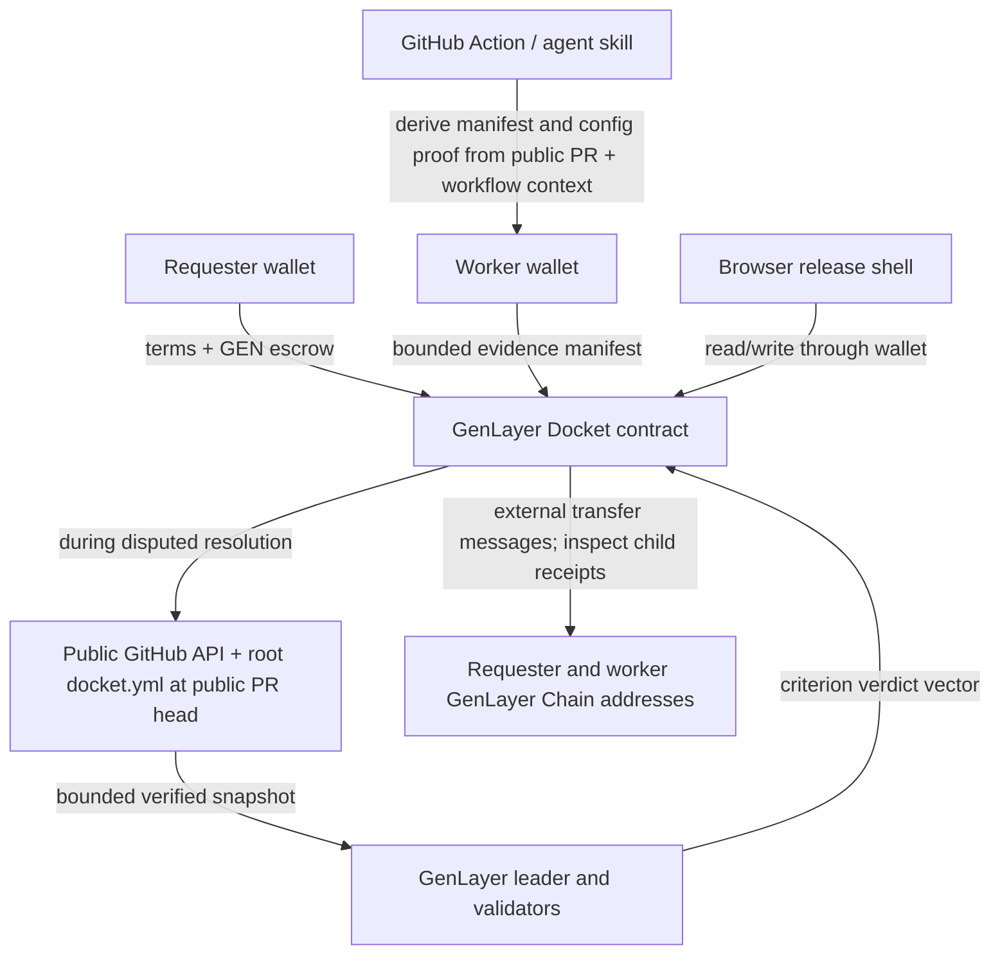
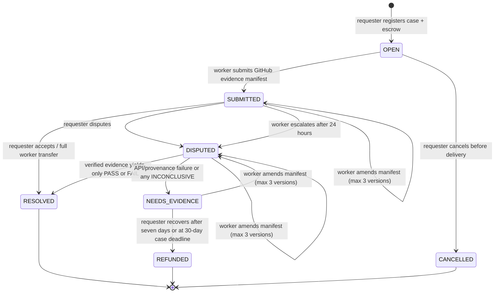

# Docket architecture

## Product boundary

Docket turns a public GitHub implementation agreement into a case with verifiable provenance and a deterministic settlement rule. It is designed for a requester and an identified worker who already have a reason to work together. It does not discover workers, hold private source code, run a proprietary CI service, or claim to prove software behavior that public GitHub facts cannot establish.

The v2 source supports public repositories only. Its evidence model is deliberately narrow: pull-request metadata, the submitted head commit, the first page of at most five changed files with excerpts capped at 4,000 characters each and 16,000 characters total, and a successful pull-request Actions run tied to the same repository, PR, and commit. The contract accepts no more than 128 KiB of GitHub JSON after download and no more than 64 KiB of config text. The JSON cap limits parsing and retained evidence rather than network transfer. This gives validators a stable factual surface for PR-sized acceptance criteria while keeping secrets and unbounded content out of the contract.

## System overview



The browser is an interface for configuration, case creation, evidence entry, transaction tracking, and sharing. It does not decide verdicts or calculate authoritative balances. The contract owns the lifecycle, escrow amount, roles, frozen checklist, accepted evidence shape, consensus comparison, and payout math.

## Trust boundaries

| Layer | Controls | Cannot establish |
|---|---|---|
| Requester and worker | Agreement terms, public repository selection, wallet actions, delivery manifest, dispute rationale | Whether the other party’s prose is true |
| Browser release shell | Wallet UX, input validation, prepared-config recovery, required Action-output checks, release configuration, local recent-case list, transaction display | Contract state, payout success, GitHub provenance, consensus outcome |
| Docket contract | Role checks, state transitions, escrow, canonical terms/manifest, GitHub fetch logic including the root config hash check, settlement arithmetic, external transfer messages | Private repository content, credentials, arbitrary software behavior, global case discovery |
| Public GitHub APIs | PR, commit, repository, changed-file, and workflow metadata exposed by GitHub | Claims not supported by their returned fields; availability or permanence of external data |
| GenLayer validators | Re-execution of public-data retrieval and criterion-level interpretation | Rewriting weights, changing terms, or overriding deterministic payout arithmetic |

Task title, checklist descriptions, changed file names, and dispute reason are untrusted data. The adjudication prompt tells validators to treat that data as evidence and never as instructions. All of it may become public contract data.

## Case creation and evidence model

A requester calls:

```text
register_task(task_id, worker, repository_url, title, checklist_json, config_sha256) payable
```

`task_id` is generated by the client before the transaction, using the `dkt-…` format. It is unique and becomes the stable case URL key. `config_sha256` is the raw lowercase SHA-256 of the browser-generated canonical v2 public `docket.yml` after normalizing line endings and one final newline. The contract reconstructs that exact file from the case ID, non-zero worker address, canonical repository URL, title, escrow wei, and separately parsed checklist, so registration rejects a hash that does not bind every term. The Action requires a non-empty root configuration no larger than 64 KiB, and the contract bounds its disputed public-file fetch at 64 KiB.

Before the browser opens the funding path, it requires the requester to prepare the exact file, copy or download it, and acknowledge that it will be committed at the public repository root before the worker opens a delivery PR. It persists the exact prepared bytes and hash in browser storage so a reload does not erase the handoff. The acknowledgement is a user statement, not evidence of a GitHub commit. Registration rejects duplicate IDs, unavailable, private, archived, disabled, invalid, or non-canonical repositories, same or zero worker addresses, zero escrow, malformed or non-canonical configuration hashes, and a checklist outside these bounds:

- 2–5 criteria;
- lowercase criterion IDs, unique within the case;
- descriptions from 8 to 500 characters;
- positive integer `weight_bps` values totaling exactly 10,000.

A worker submits or supplements a JSON manifest with only these fields:

```json
{
  "pr_url": "https://github.com/owner/repo/pull/42",
  "head_sha": "40 lowercase hexadecimal characters",
  "actions_run_url": "https://github.com/owner/repo/actions/runs/123"
}
```

The contract validates each URL against the exact registered repository, parses the canonical PR and Actions run IDs, and preserves the canonicalized manifest. A manifest is not proof by itself. The GitHub Action's separate proof stays offchain and is never submitted as contract evidence. The browser requires both the manifest and proof, then checks the supported proof schema, task ID, repository, exact manifest hash, root config path, `proof.config.sha256`, Actions-run ID against `manifest.actions_run_url`, and a positive workflow-run attempt before it sends the three-field manifest.

## Public GitHub verification and consensus

When either task party calls `resolve_dispute`, leader and validator executions independently retrieve these public GitHub API resources:

- the pull request;
- the first bounded page of changed files;
- the referenced Actions run.
- the repository-root `docket.yml` at `raw.githubusercontent.com/<public-pr-head-repository>/<submitted-head-sha>/docket.yml`.

The contract derives a bounded snapshot containing public repository identity, PR state/merge status, PR head SHA, changed-file metadata and capped patch excerpts, Actions status/conclusion/head SHA/event/run attempt, and relationship checks. The root configuration comes from the public PR head repository, which may be the task repository or a public fork. Those relationships require that the PR base repository and Actions run repository match the task repository, both are public, the manifest SHA matches the PR head, the Actions run SHA matches the PR head, the Actions run is a successful `pull_request` run that links to the submitted PR, and the normalized root `docket.yml` hash and exact canonical terms match registration.

A snapshot with an unavailable source, invalid data, or a relationship mismatch cannot settle a payment. The contract records an `INCONCLUSIVE` finding for every criterion and enters `NEEDS_EVIDENCE`. This applies when `docket.yml` is absent at the submitted immutable head, exceeds 64 KiB, cannot be read as bounded UTF-8 text, or its normalized hash differs from registration. This verification belongs only to `resolve_dispute`; `accept_delivery` remains a requester-authorized full payout without a GitHub fetch.

For verified snapshots, the prompt presents the frozen checklist, submitted provenance fields, snapshot, and dispute context. It instructs the model to use `PASS` only when supplied facts clearly establish a criterion, `FAIL` when they clearly establish non-compliance, and `INCONCLUSIVE` when the facts do not decide it. Validators compare the bounded snapshot plus normalized verdict vector. Explanatory text cannot alter settlement.

This makes the nondeterministic boundary small:

```text
Public GitHub facts + frozen criterion -> PASS | FAIL | INCONCLUSIVE
```

The terms, status transitions, and arithmetic remain deterministic contract logic.

## Lifecycle



`NEEDS_EVIDENCE` is a fail-closed state. It avoids paying based on missing, mismatched, or insufficient public evidence. The worker can submit up to three evidence versions, including amendments while a case is submitted or disputed. Recovery is available only from `NEEDS_EVIDENCE`: the requester can recover seven days after the latest inconclusive review, or once the absolute deadline thirty days after case creation has elapsed. An amendment moves the case back to `DISPUTED`, so that evidence must be adjudicated before either recovery path becomes available again.

## Value flow

The payable registration method records `gl.message.value` as the case escrow. A requester acceptance pays the worker the full amount. A conclusive disputed resolution applies:

```text
worker_amount    = escrow_amount × passed_bps ÷ 10,000
requester_amount = escrow_amount − worker_amount
```

The requester receives the integer remainder. Non-zero shares call the GenLayer external transfer interface for the registered non-zero addresses. `INCONCLUSIVE`, invalid evidence, unavailable GitHub API data, and provenance mismatch cause no transfer. A parent settlement result only determines allocation; payment is confirmed after every applicable child receipt finalizes successfully.

A finalized parent transaction is not enough evidence of a successful payout. The release shell waits for finalization and checks the execution result; release evidence also preserves triggered child transaction IDs when the runtime exposes them. Studio's current EVM transfer path exposed no child IDs in either founder-operated pilot. The full-acceptance proof recorded a 1 GEN worker allocation and zero contract balance; the disputed proof recorded 0.7 GEN for the worker, 0.3 GEN for the requester, and zero contract balance after the finalized resolution.

## Browser release shell

`frontend/` is a Vite application that starts without a hardcoded case or assumed contract. At runtime it:

1. loads a versioned public release manifest;
2. uses optional non-secret local configuration for network and contract address;
3. calls a read-only method to verify the configured address before enabling writes;
4. connects an EIP-1193 wallet only after the user selects Connect;
5. prepares a public `docket.yml`, requires export plus a commit acknowledgement before funding, retains the exact prepared file locally, and calculates its committed hash;
6. requires both Action JSON outputs before evidence submission, validates their relationship locally, and sends only the accepted three-field manifest;
7. persists a returned transaction ID immediately after a wallet request, then updates it from receipt status;
8. refreshes contract data only after a finalized, successful execution result;
9. keeps recently opened case IDs in browser storage, explicitly as a local convenience rather than a global index.

The checked-in manifest pins the verified Studio Next address and RPC, exact source SHA-256, bootstrap deployment transaction, and finalized activation transaction.

## Operational safety

- Browser configuration and local transaction history contain no private key material.
- The application does not make writes on page load or blindly retry submitted transactions.
- Inputs have client-side validation for usability; contract validation remains authoritative.
- Public GitHub only means no private repository URL, token, webhook secret, CI secret, or customer data should enter the case.
- The GitHub Action and agent skill derive manifests from existing public pull-request and workflow context. The supplied target-repository workflow checks out the submitted PR head with `persist-credentials: false` and writes the two JSON outputs into the job summary. Neither becomes a privileged source of truth.
- A production pilot needs a clear retention policy for any off-chain participant notes; contract data should be treated as permanent/public.

## Deployment and proof status

Docket v2 is deployed on Studio Next at `0xa6f640F8bb879c9336F9D5A0a8fBdD4f810Af7B3`. The live code is 46,719 bytes with SHA-256 `deda418529318e01b7bd3a0766fea648304378eb730e348537037442f3f991c7`; its schema exposes 11 methods. Founder-operated disputed case `dkt-dispute-7030-20260912` registered 1 GEN against `shalyx/touchline-relay`, submitted public PR #2 and successful Actions evidence, and asked validators to judge an intentionally partial delivery. The finalized findings were `PASS / PASS / FAIL`, producing 7,000 passed basis points, 0.7 GEN for the worker, 0.3 GEN returned to the requester, and a zero contract balance. The next proof is use by external requester and worker participants.
