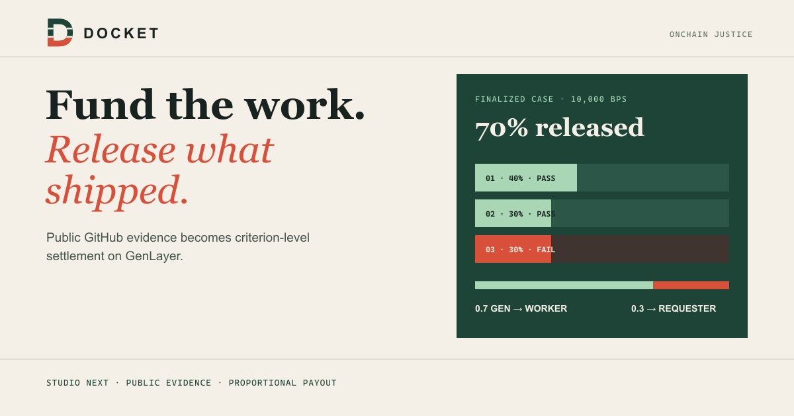
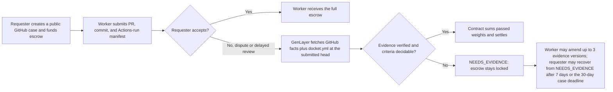

# Docket



**Live demo:** [docket-seven-hazel.vercel.app](https://docket-seven-hazel.vercel.app/) · [GitHub Pages mirror](https://shalyx.github.io/docket/)

**Docket is the evidence and proportional-settlement layer for paid implementation work on public GitHub.** A requester funds a short, weighted acceptance checklist for a known worker. The worker supplies a pull request, commit, and GitHub Actions run. If the work is disputed, GenLayer independently reads bounded public GitHub facts and settles only the share supported by those facts.

Launch-ready logo, portal, social-preview, favicon, and demo-thumbnail files are collected in [`brandkit/`](brandkit/README.md).

> **Current release state:** Docket v2 is deployed on Studio Next at `0xa6f640F8bb879c9336F9D5A0a8fBdD4f810Af7B3`. Its 46,719-byte source and 11-method schema are verified through `https://studio-next.genlayer.com/api`. Founder-operated cases on this instance prove both routes: `dkt-accept-drill-20260913` paid the full 1 GEN escrow after requester acceptance, while `dkt-dispute-7030-20260912` independently verified public PR #2 and its successful Actions run, returned `PASS / PASS / FAIL`, and split 1 GEN proportionally. Both finalized with a zero contract balance. External-user validation remains open.

## The product we are building

Docket is for direct, PR-sized agreements between technical founders, AI development teams, and agent builders. It is not a global job board. The first useful unit is a shareable case that answers four questions: what was promised, what public evidence was delivered, which facts were independently verified, and how the escrow settled.

A requester creates a case with a public repository, a worker wallet, 2–5 weighted criteria, and GEN escrow. The worker submits a bounded evidence manifest:

```json
{
  "pr_url": "https://github.com/owner/repo/pull/42",
  "head_sha": "40-character lowercase commit SHA",
  "actions_run_url": "https://github.com/owner/repo/actions/runs/123"
}
```

The contract binds those URLs to the registered repository. Registration first verifies that the canonical repository is reachable, active, and public, then accepts only the hash of its canonical v2 `docket.yml` rendering for the exact case ID, worker address, title, escrow in wei, and checklist. During a disputed resolution, each consensus participant fetches public GitHub facts for the pull request, first page of up to five changed files, Actions run, and the repository-root `docket.yml` from the public PR head repository at the submitted immutable head SHA. That head repository may be the task repository or a public fork; the PR base repository and Actions run must still match the registered task repository. The workflow run must be a successful `pull_request` run linked to the submitted PR and head. The contract keeps at most 4,000 characters of each file patch and 16,000 patch characters in total. It accepts no more than 128 KiB of GitHub JSON after download and no more than 64 KiB for the public config file; the JSON limit is a parsing and retention guard, not a streaming network limit. The contract normalizes the fetched file to LF line endings with one final newline, hashes it, and requires that hash to equal the registered `config_sha256`. A missing, unreadable, oversized, or mismatched configuration, repository, workflow, or commit relationship puts the case in `NEEDS_EVIDENCE`; it cannot settle a disputed payment. Validators then decide only the pre-priced criteria from the bounded verified snapshot. `accept_delivery` remains a requester-authorized full payout without a GitHub fetch.



## Why this is more than a fixture

The old presentation treated an 80/20 case as a built-in result. That is not the product. The v2 frontend contains no canonical task, verdict, amount, or payout result. It reads a configured contract and renders only a case supplied by its ID or share URL.

The browser release shell:

- loads a versioned `public/release-manifest.json` pinned to the verified Studio Next release;
- targets the hackathon-mandated Studio Next preview (`studioNext`, chain ID 61997), lets a user provide a contract address, and verifies it with a read-only contract call before enabling writes;
- connects an EIP-1193 wallet only after an explicit user action and never handles private keys;
- generates a unique `dkt-…` case ID and public `docket.yml` before registration, requires the requester to copy or download it and acknowledge the public-root commit before funding, then freezes its normalized configuration hash onchain;
- persists the exact prepared configuration in browser storage so a reload does not discard it before registration; the acknowledgement records intent and is not proof that GitHub received a commit;
- records pending transaction IDs locally, waits for finalization, checks execution success, and links parent and triggered transactions when the network supplies them;
- surfaces an in-browser Recovery & Exception Center for `NEEDS_EVIDENCE`, inconclusive-case recovery, failed execution, and payout-message exceptions without inventing a retry or resubmitting a wallet request;
- downloads a compact, portable JSON case receipt containing the public terms, bounded evidence summary, criterion findings, settlement amounts, and protocol execution status without exporting raw patches or logs;
- projects the requester recovery window from the case timestamps, showing when the seven-day or absolute deadline path may open while leaving the contract as the final authority;
- stores only the browser’s recently opened cases locally. It does not pretend to index a marketplace.

The app keeps write actions disabled until it verifies the manifest-pinned address, live source hash, schema, and finalized activation transaction.

## Contract surface

| Method | Caller | Purpose |
|---|---|---|
| `register_task(task_id, worker, repository_url, title, checklist_json, config_sha256)` | requester, payable | Verifies an active public GitHub repository, locks GEN, and binds a non-zero worker address, frozen 10,000-bps checklist, and canonical v2 `docket.yml` hash generated from those terms |
| `submit_delivery(task_id, evidence_manifest_json)` | worker | Records the initial bounded GitHub evidence manifest |
| `accept_delivery(task_id)` | requester | Releases the full escrow without disputed adjudication |
| `open_dispute(task_id, reason)` | requester | Moves a submitted case into disputed state |
| `escalate_submission(task_id, reason)` | worker, after 24 hours | Prevents a silent requester from blocking review indefinitely |
| `supplement_evidence(task_id, evidence_manifest_json)` | worker | Replaces a superseded manifest while submitted, disputed, or inconclusive; maximum three evidence versions |
| `resolve_dispute(task_id)` | either party | Fetches public GitHub facts through consensus, records findings, and either settles or requests more evidence |
| `refund_inconclusive_task(task_id)` | requester | While the case is in `NEEDS_EVIDENCE`, returns escrow seven days after the inconclusive decision or once the absolute 30-day deadline has elapsed |
| `cancel_task(task_id)` | requester | Returns escrow before delivery is submitted |
| `get_task(task_id)` | anyone | Returns terms, evidence manifest/snapshot, findings, state, and settlement fields |
| `get_task_count()` | anyone | Returns the number of registered cases |

## Evidence and settlement boundary

Only canonical lower-case `https://github.com/owner/repo` repositories are accepted, and registration checks GitHub reports the repository public, active, and reachable. The manifest must point to that repository and include a lower-case 40-character head SHA. On disputed resolution, the contract reads public GitHub API responses and the root `docket.yml` from the public PR head repository at that exact SHA, rather than browser-supplied copied logs. The head repository may be a public fork, while the PR base repository and Actions run still must match the registered repository. The Actions run must be a successful `pull_request` run that names the submitted PR and its head. The normalized file hash must equal the `config_sha256` recorded by `register_task` and the canonical v2 agreement reconstructed from the task terms.

Public provenance is still limited evidence. A pull request, changed-file list, and CI result do not prove every possible software claim. Criteria must be written so those bounded facts can support a clear decision. When the API is unavailable, its response is invalid, provenance does not match, or a criterion cannot be decided, the contract records `INCONCLUSIVE`, moves the case to `NEEDS_EVIDENCE`, and sends no payment.

For conclusive findings:

```text
worker amount    = escrow × passed basis points ÷ 10,000
requester amount = escrow − worker amount
```

The requester receives the deterministic integer remainder. Non-zero payments emit external transfers to the registered non-zero GenLayer Chain addresses. The current Studio EVM path may settle those transfers inside the finalized parent without exposing GenLayer child IDs. Founder-operated pilots have verified both routes: a requester-authorized 1 GEN full payout and a validator-adjudicated 70/30 split whose finalized state assigned 0.7 GEN to the worker, returned 0.3 GEN to the requester, and left a zero contract balance.

All case data is public contract data. Do not submit credentials, private repository links, private logs, customer data, or secrets. The pilot supports public GitHub repositories only.

## Pilot and distribution path

The first customer motion is a concierge pilot with teams already paying for public-repository implementation work. A pilot case should use real acceptance terms, a real worker wallet, a public PR, and a public Actions run. Docket’s operator can help participants author evidence-friendly criteria, but the parties retain the agreement and wallet actions.

Docket was initially conceived as a module behind an existing job or escrow protocol. The direct GitHub-native flow removed that integration dependency and made the core mechanism testable end to end during the build. Protocol integrations remain a later distribution path once external pilots prove the primitive.

Distribution starts where that work already happens:

- the browser generates the canonical repository-root v2 `docket.yml` from the public terms, criteria, worker address, and exact escrow wei amount; it requires an export and acknowledgement before the requester can fund the case, and retains the generated file locally for recovery;
- a vendored GitHub Action checks out the exact PR head with `persist-credentials: false`, derives the delivery manifest and proof without exporting secrets, and publishes both JSON objects in the workflow job summary;
- the worker pastes both Action outputs into Docket; the browser requires both, checks the proof schema, task, repository, root config path/hash, exact manifest hash, matching Actions-run ID, and positive run attempt, then sends only the three-field manifest to the contract. The proof is onboarding metadata; contract settlement independently verifies GitHub data and does not trust proof content;
- an agent skill gives coding agents the same manifest and handoff format;
- the stable case URL becomes the artifact a requester can share in an issue, pull request, or client handoff.

Before the Action is published, a pilot repository vendors the included action directory at `./.docket/github-action` and copies `integrations/github-action/target-repo-workflow.yml` into its own workflow directory. The Action proof is offchain handoff metadata, not a contract argument. Registration holds the immutable configuration hash, and evidence submission sends only the three-field manifest; when resolving a dispute, the contract independently rechecks the root configuration from the public PR head repository at the submitted SHA before it can settle. The source repository ships Action checks, not an evidence workflow for its example `docket.yml`. These materials are onboarding assets, not evidence that external teams have installed or used them.

## Run locally

### Contract checks

Requirements: Python 3.12+, `genvm-linter`, and `genlayer-test`.

```bash
python -m pip install -r requirements.txt
genvm-lint lint contracts/docket.py --json
python -m pytest tests/direct -v --contracts-dir contracts
```

The direct suite pins GenVM `v0.2.16` in `tests/direct/conftest.py`, matching the contract's immutable `py-genlayer` dependency. This bypasses `genlayer-test==0.29.2`'s stale latest-release lookup while retaining the stable direct runner used by the contract. Do not remove that pin until a newer testing-suite release can load this contract and its runner in a clean environment.

The direct suite covers task-ID and canonical configuration binding, public-repository preflight, GitHub workflow provenance, bounded patch evidence, external transfer emission for every payout route, proportional settlement, role controls, evidence amendments, and recovery deadlines. It passed all 28 tests on this source. The legacy hosted-integration template is not Studio Next validation; Studio Next validation requires the v0.6-compatible prerelease test tooling after the hosted runner preflight succeeds.

### Browser release shell

```bash
cd frontend
npm install
npm run dev
```

Open the Vite URL shown in the terminal. Configuration defaults come from `frontend/public/release-manifest.json`; optional non-secret defaults can be placed in `frontend/.env` from `frontend/.env.example`. Read [frontend/README.md](frontend/README.md) before configuring a network or address.

## What remains before broader public claims

1. Conduct the first consented external pilot, then report only the evidence actually observed: completed cases, failure modes, participant feedback, and settlement receipts.
2. Repeat deployment and settlement on a durable network after the Studio Next preview phase before describing Docket as production-network infrastructure.
3. Publish customer names or case studies only with participant consent.

Docket now has completed founder-operated Studio Next proofs for full acceptance and disputed proportional settlement. Do not describe it as customer-validated or production-network usage until external pilots and durable-network validation exist.

## Repository map

```text
contracts/docket.py                 Public-GitHub evidence escrow contract
frontend/                           Vite browser release shell
integrations/github-action/         Manifest-generation GitHub Action and sample config
skills/docket/                      Agent handoff skill
PILOT.md                            Concierge-pilot operating guide
ARCHITECTURE.md                     Trust boundaries, lifecycle, and evidence model
SUBMISSION.md                       Startup positioning and execution proof plan
DEMO_SCRIPT.md                      Recording plan for a real public case
```

## Track

**Onchain Justice** — Docket makes a subjective public-evidence review accountable to a deterministic, on-chain proportional settlement rule.
